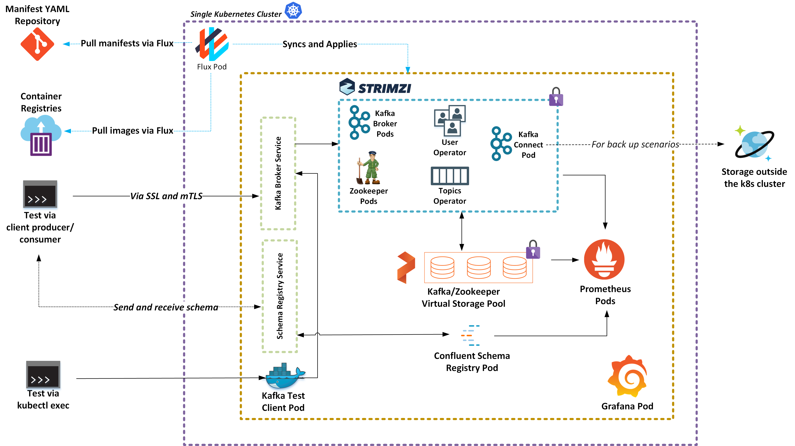

# fabrikate-kafka-sample

This goal of this Fabrikate defintion is to provide an end to end example of running a secure stateful workload with backed by virtual storage on a single Kubernetes cluster.

## Overview

The following components are deployed on to your AKS cluster:
* Strimzi Kafka Operator (including Kafka Connect)
* Confluent Schema Registry
* Prometheus
* Grafana
* [Stork & Portworx](/portworx-manual/README.md) (Disabled by Default)

## Installation Instructions

1. Install Portworx manually on your Kubernetes cluster
2. Setup a Bedrock [gitops pipeline](https://github.com/microsoft/bedrock/tree/master/gitops) with this repository has your _high level definition_
3. Set up Grafana dashboards
4. Run tests to validation installation 

## Validations

The repository provides multiple tests to help prove the end to end goal. We have tests that execute from within the cluster and from outside the cluster. Additionally load tests targeted at the virtual storage layer and end to end layer using TLS mutual authentication. 

## Caveats

Currently Portworx must be installed manually due to the lack of a Helm chart. Please refer to [instructions]() on how to successfuly install this sample.

## Future Work

- [ ] Work with Portworx on Helm Chart
- [ ] Enable volume encryption on Portworx volumes
- [ ] Get past possible VNET issues in Terraform template

## Additional Notes

This sample also sets up a default scalable Kafka Cluster configuration (see [manifests/kafka-cluster.yaml](./manifests/kafka-cluster.yaml)) with persistent volumes, three replicas and TLS mutual authentication.

It also includes Kubernetes network policies to restrict traffic to the Kafka cluster (see [manifests/kafka-networkpolicy.yaml](./manifests/kafka-networkpolicies.yaml)). Only TLS traffic is permitted to the Kafka cluster. Plaintext is only permitted for the Confluent Schema Registry app.

## Setting Up Grafana Dashboards

The sample configuration provided does not expose grafana and prometheus metrics through an externally accessible IP. You may choose to create an external IP. Alternatively, you can connect to your cluster and port forward the grafana dashboard.

`kubectl port-forward [POD NAME HERE grafana] -n grafana 3000`

Browse to `localhost:3000/dashboard/import`.

There are six dashboards [Kafka, Kafka Connect, Zookeeper Metrics, Portworx Node, Portworx Volume, and Portworx Cluster] included in the `dashboards/` folder. You can either copy paste the content of the json files or use the "Upload .json File".
