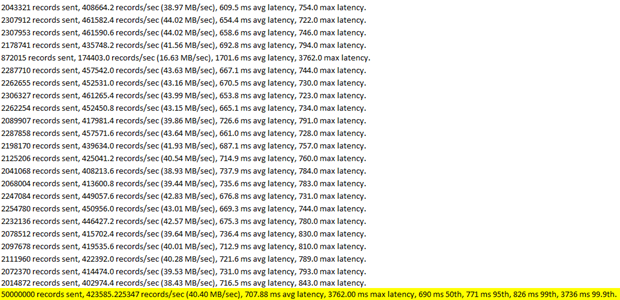
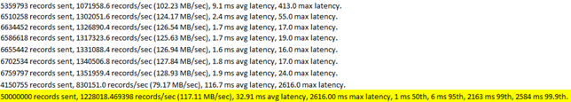
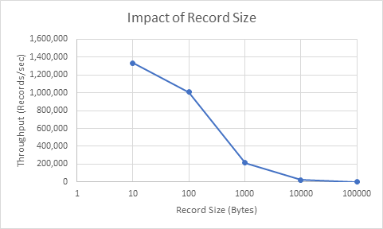

# Kafka Stateful Sample Workload Performance Testing and Metrics Analysis 

[_metadata_:author]:- "Claudia Nadolny - cnadolny | Nathaniel Rose - nathanielrose"
[_metadata_:date]:- "15/09/2019"


## Overview

Performance testing was completed on various Kafka on Kubernetes configurations on Azure. Built in Kafka performance tests were used to benchmark various Kafka options. Performance tests were referenced from [this Github gist](https://gist.github.com/jkreps/c7ddb4041ef62a900e6c), which were written for this [benchmarking article](https://engineering.linkedin.com/kafka/benchmarking-apache-kafka-2-million-writes-second-three-cheap-machines) that was conducted at LinkedIn. You can run the scripts [here](README.md) to set up a Kubernetes cluster with the Kafka Helm Charts installed, to try the tests out for yourself. 

Performance tests were executed from a pod deployed on an AKS cluster, running the latest Kafka container image. 

Results from these tests indicate that while hardware selection does make an impact on performance, settings adjusted on the Kafka broker and on the producer made a larger performance impact overall.  

## Kafka Performance on Various AKS Specs  

The following factors were tested 

- Batch size 
- Changing the default Kafka broker configurations 
- Virtual Machine Size 
- Storage Size 

The following command was run to execute the performance tests: 
``` sh
kubectl exec -it kafkaclient-0 -- bin/kafka-producer-perf-test.sh --topic test-one-rep --num-records 50000000 --record-size 100 --throughput -1 --producer-props acks=1 bootstrap.servers=kafka-headless:9092 buffer.memory=67108864 batch.size=8196 
```
 

This will execute a performance test on a pod called kafkaclient-0, running in Azure Kubernetes Service cluster, that will send a total of 50,000,000 records of size 100 bytes, in batches of size 8196. Throughput is -1, which means that there will be no throttling of the messages. 

## Impact of Kafka broker settings 

This section will compare performance resulting from changing a few select settings on the Kafka broker from the defaults to custom values. The settings below are a few of many factors that can be adjusted to your Kafka scenarios needs. 

**Default Kafka Settings:**

|        Setting             |    Purpose                             |     Default Value          | 
|----------------------------|----------------------------------------|----------------------------| 
| `num.partitions`           | number of threads running to handle the network requests   | 3      | 
| `socket.send.buffer.bytes` | sets the SO_SNDBUFF buffer size for socket connections     | 102,400| 
| `socket.receive.buffer.bytes` | sets the SO_RCVBUFF buffer size for socket connections  | 102,400| 
| `num.partitions`           | sets the number of default partitions for a topic created  | 1      | 

Performance test run with the above default settings: 



**Custom Kafka broker settings:** 
| Setting                       | Purpose                                                    | Default Value | Changed Value | 
|-------------------------------|------------------------------------------------------------|---------------|---------------| 
| `num.partitions`              | number of threads running to handle the network requests   | 3             | 4             | 
| `socket.send.buffer.bytes`    | sets the SO_SNDBUFF buffer size for socket connections     | 102,400       | 1,048,576     | 
| `socket.receive.buffer.bytes` | sets the SO_RCVBUFF buffer size for socket connections     | 102,400       | 1,048,576     | 
| `num.partitions`              | sets the number of default partitions for a topic created  | 1             | 8             | 

**Performance test run with the above custom settings:**


### Conclusion:

Increasing the number of partitions from 1 to 8, network threads from 3 to 4, and socket send and receive buffer bytes from 102,400 to 1,048,576 increased throughput from 40 MB/sec to 117 MB/sec. Average latency also decreased, from 707 ms to 33 ms. With the custom settings, records were able to be grouped into larger batches, and completed faster in comparison to the default settings. 

## Impact of batch size

50,000,000 million records were sent, at 100 bytes per record, with varying batch sizes. The `buffer.send` and `buffer.receive` values were set to 1,048,576. 

| batch size | throughput  | avg latency | max latency | 
|------------|-------------|-------------|-------------| 
| 100        | < 1 MB/sec  | timeout     | timeout     | 
| 1,000      | 4.5 MB/sec  | 11,389 ms   | 12,289 ms   | 
| 10,000     | 38.4 MB/sec | 1,476 ms    | 2,893 ms    | 
| 100,000    | 119 MB/sec  | 17 ms       | 1,754 ms    | 
| 1,000,000  | 116 MB/sec  | 29 ms       | 1,346 ms    | 

50,000,000 million records sent on default Kafka broker settings, where `buffer.send` and `buffer.receive` where set to 102,400: 



### Conclusion 

Results showed that selecting too small of a batch size – such as 100, when there was a large socket buffer – was not ideal, as timeouts occurred from too many batches being sent too quickly to the broker. Generally, increasing the batch size increased throughput and decreased latency, up to a point where it plateaus.  

## Impact of Virtual Machine type 

| DS5_V2                                | DS4_V2                                | DS3_V2                    | 
|---------------------------------------|---------------------------------------|---------------------------| 
| 16 vCPU                               | 8 vCPU                                | 4 vCPU                    | 
| 56 Memory GiB                         | 28 Memory GiB                         | 14 Memory GiB             | 
| 112 Temp Storage (SSD) GiB            | 56 Temp Storage (SSD) GiB             | 28 Temp Storage (SSD) GiB | 
| Cost: $0.916/hour per virtual machine | Cost: $0.458/hour per virtual machine | Cost: $0.229/hour per VM  | 

### Comparison Chart 

50,000,000 records were sent, where each record was 100 bytes, and sent in batches of size 8196. Tests were run with “fire and forget” method (acks = 1), as well as waiting for all broker acknowledgement (acks = -1). 

| acks | DS5_V2                | DS4_V2                | DS3_V2               | 
|------|-----------------------|-----------------------|----------------------| 
| 1    | 1,297,353 records/sec | 1,209,716 records/sec | 324,801 records/sec  | 
|      | 124 MB/sec            | 115 MB/sec            | 31 MB/sec            | 
|      | 5 ms avg latency      | 8 ms avg latency      | 1348 ms avg latency  | 
|      |                       |                       |                      | 
| -1   | 801,102 records/sec   | 878,364 records/sec   | 259.,913 records/sec | 
|      | 76 MB/sec             | 84 MB/sec             | 24.79 MB/sec         | 
|      | 302 ms avg latency    | 239 ms avg latency    | 1848 ms avg latency  | 

### Conclusion

There were significant performance improvements seen from selecting a higher tier machine when comparing the DS3_V2 to the DS4_V2, but the DS4_V2 and DS5_V2 had relatively similar performance results. 

## Impact of Node Count 

**3 Node vs 6 Node AKS Cluster:** 

| acks | nodes | records/sec | mb/sec | ms avg latency | 
|------|-------|-------------|--------|----------------| 
| 1    | 3     | 910,531     | 86.84  | 1.75           | 
| 1    | 6     | 1,297,353   | 123.73 | 5.05           | 
| -1   | 3     | 835,896     | 79.72  | 114.82         | 
| -1   | 6     | 801,102     | 76.4   | 301.58         | 

### Conclusion

There were improvements seen from increasing node count from three to six nodes, which meant that each broker and zookeeper instance were scheduled on different nodes. 

## Impact of Storage 

### 128 GB (P10) vs 1TB (P30) Premium Storage: 

Testing was done to see if there were differences in performance among various sized attached disks. Two tiers were chosen from this [list of Azure storage tiers](https://azure.microsoft.com/en-us/pricing/details/managed-disks/), which were the P10 and P30 premium SSD managed disks. 

| P10:                              | P30:                              | 
|-----------------------------------|-----------------------------------| 
| 128 GiB                           | 1Ti                               | 
| $17.92 per month                  | $122.88 per month                 | 
| 500 IOPS per disk                 | 5,000 IOPS per disk               | 
| 100 MB/second throughput per disk | 200 MB/second throughput per disk | 

There were minimal differences in performance between the two tiers.

| acks | size  | throughput | avg latency | max latency | 
|------|-------|------------|-------------|-------------| 
| 1    | 128Gi | 111 MB/sec | 3 ms        | 419 ms      | 
| 1    | 1Ti   | 111 MB/sec | 27 ms       | 1774 ms     | 
| -1   | 128Gi | 111 MB/sec | 37 ms       | 2577 ms     | 
| -1   | 1Ti   | 110 MB/sec | 18 ms       | 1431 ms     | 

### Observations

There were issues seen with disk size when using lower storage tiers such as 32 GiB (P4). Since the tests send 50 million messages at 100 bytes per message, and we were testing without compression, each test would take up 5Gi of storage, and the disk would run out of space quickly. 

### Conclusion

Calculating estimated storage needs is essential. By default, Kafka does not set compression on the broker or producer end, which means that space can be calculated by multiplying number of messages sent by each record size, and then by the number of replications of the topic. 

Compression can be set on either the producer or broker side, which can be useful when dealing with messages of large size. By default, Kafka brokers set the compression.type to be producer, which means that the producer specifies the compression type sent to a topic. Kafka supports numerous standard compressions codecs, such as `gzip`, `snappy`, `lz4`, and `zstd`.  

## Kafka Performance with Virtualized Storage  

Introduction: 

- [Portworx](https://portworx.com/) is a storage architecture that provides solutions for stateful container storage and is intended for distributed systems. Along with storage, Portworx also includes features such as data security, disaster recovery, migrations, and auto-scaling for your Kubernetes workloads. 
- [Strimzi](https://github.com/strimzi/strimzi-kafka-operator) is an open source Kafka on Kubernetes operator.  

| Description                                    | TLS Enabled | Nodes   | Records Sent | Records/sec | Data/sec   | Avg Latency |
|------------------------------------------------|-------------|---------|--------------|-------------|------------|-------------|
| Kafka + Zookeeper \| Portworx                  | No          | 3       | 50,000,000   | 1,116,545   | 106 MB/sec | 44 ms       |  
| Kafka + Zookeeper Helm Charts \| Mounted Disks | No          | 3       | 50,000,000   | 910,531     |   87 MB/sec  | 1.75 ms   | 

### Conclusion: 

There was an increase in throughput observed when using Portworx as a storage option in comparison to mounted disks on Azure Kubernetes Service. 

## Kafka & Security

| Description                                    | TLS Enabled | Nodes   | Records Sent | Records/sec | Data/sec   | Avg Latency | Max Latency | 
|------------------------------------------------|-------------|---------|--------------|-------------|------------|-------------|-------------| 
| Kafka + Zookeeper \| Portworx                  | No          | 3       | 50,000,000   | 1,116,545   | 106 MB/sec | 44.19 ms    | 1848.00 ms  | 
| Kafka + Zookeeper Helm Charts \| Mounted Disks | No          | 3       | 50,000,000   | 910,531     | 87 MB/sec  | 1.75 ms     | 1721.00 ms  |
| Strimzi \| Portworx                            | No          | 3       | 50,000,000   | 969,255     | 92 MB/sec  | 140 ms      | 3051.00 ms  | 
| Strimzi \| Mounted Disks                       | Yes         | 3       | 50,000,000   | 453,666     | 43 MB/sec  | 1316 ms     | 8682.00 ms  | 
|                                                | No          | 3       | 50,000,000   | 955,401     | 91 MB/sec  | 108 ms      | 7304.00 ms  | 

### Conclusion: 

Running performance tests on TLS-enabled Kafka clusters had a performance impact. Kafka clusters without TLS enabled ran with about 90-100 MB/sec, whereas with TLS throughput would decrease to about 40 MB/sec. 

## Data Replication in Kafka 

This sections covers a brief description of the different data replication tools available for Kafka. 

### Confluent Replicator 

[Confluent Replicator](https://docs.confluent.io/current/multi-dc-replicator/mirrormaker.html ) is Confluent’s solution to replicating data between Kafka clusters, and fills the gaps of many of the issues that are currently exist today with Kafka MirrorMaker. A paid license is necessary in order to use this tool. 

### MirrorMaker  

[MirrorMaker](https://cwiki.apache.org/confluence/display/KAFKA/KIP-382%3A+MirrorMaker+2.0 ) is a tool used for copying data from one Apache Kafka cluster to another, and is a tool that comes shipped with Apache Kafka. At a high level it is a Kafka consumer and producer hooked together that relies on using ZookeeperConsumerConnect to listen to the partitions for issues such as leader changing, and then signaling consumer groups to re-balance accordingly in response. 

Since the origin and destination clusters are completely independent, they can have different numbers of partitions. There is currently a proposal in place for the creation of Mirror Maker V2 to address some of the lasting problems with the tool:  

### uReplicator  

[uReplicator](https://github.com/uber/uReplicator) is an open source Kafka replication solution created by Uber as an improvement to Apache Kafka MirrorMaker, highlighting improvements on high performance, scalability, and stability. uReplicator is managed by a Helix controller, which is a generic cluster management framework that manages many uReplicator workers which register themselves as Helix participants.  

The following are the goals of uReplicator: 
- Stable mirroring by rebalancing only during startup 
- Simple operations to scale up a cluster 
- High throughput 
- Time SLA of ~5min 

https://github.com/uber/uReplicator/wiki/uReplicator-Design 

### LinkedIn Brooklin 

[Brooklin](https://github.com/linkedin/brooklin) is an open source Kafka replication solution created by LinkedIn.  
